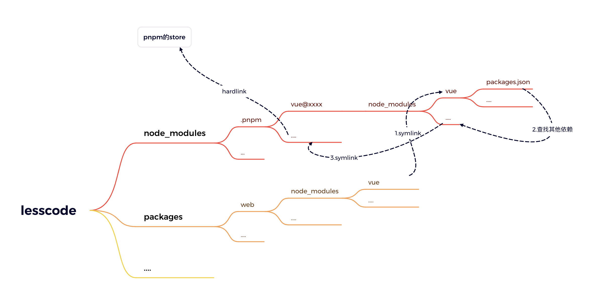
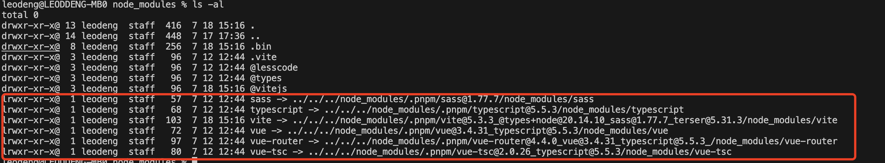

# 项目介绍

由于对低代码的好奇，所以打算尝试这个项目。该项目未来将要实现的功能如下

1.能够可视化编程

提供一个可视化组件仓库,用户可在LessCode平台利用仓库中的组件自由组合,搭建自己项目的页面

2.动态路由

可对自己搭建的页面配置路由

3.提供sdk供用户使用

# 为啥使用 pnpm + lerna

## 1.pnpm

文章推荐：

https://www.cnblogs.com/cangqinglang/p/14448329.html
https://juejin.cn/post/7044807973868142622

> 结合项目理解。首先，web项目导入vue时，会去node_modules查找对应vue库，而使用pnpm安装的vue库实际是一个软连接到根目录下的node_modules中的依赖

> 此时如果vue还依赖其他库则去node_modules中查找，而此vue目录中根本就没有node_modules，所以他会向上查找node_modules文件，直到根目录的node_modules。这也就是为什么根目录的node_modules会有如此之多的依赖文件。这里其实和npm3+/yarn的扁平化依赖很像，只不过这里避免了幽灵依赖问题。

关于幽灵依赖可以查看：https://jishuzhan.net/article/1809409650408296449

> 我们来思考一下他是咋解决幽灵依赖的：假如我的vue依赖了a，a依赖b，如果我们想直接访问b，如果是npm3+/yarn依赖直接拍平到node_modules下，也就是说vue通过依赖查找规则是可以查到b的。而使用pnpm时，a的软连接到node_modules/.pnpm/a@xxx/node_modules/a，它的依赖b又是一个软连接，连接到node_modules/.pnpm/a@xxx/node_modules/b，vue按照查找规则只能查找到node_modules/.pnpm而无法访问里面的依赖。所以vue无法访问到b也就产生隔离。当然，这也解决了访问路径过长问题，通过软连接将依赖放到上层去，大大缩短了访问路径。

# 创建组件方案

1.通过vscode连接到该平台实时更新
优点：可利用vscode生态的各种插件
缺点：操作麻烦，得手动启动自己vue项目并连接平台2.利用在线编辑器编辑查看组件
优点：方便开发
缺点：提示方面支持度不高
